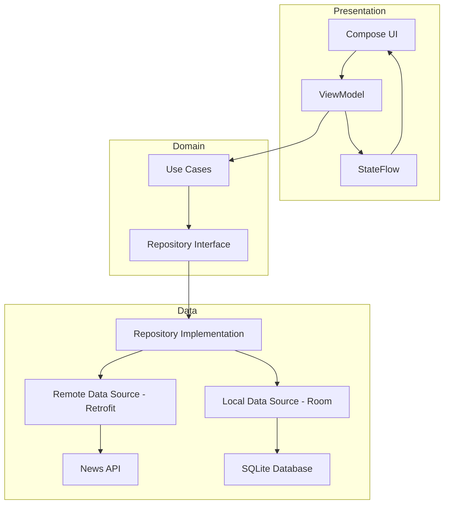

# NewsApp - Modern Android News Reader

NewsApp is a high-performance, production-ready Android application built with **Clean Architecture** and **Jetpack Compose**. It provides a seamless news-browsing experience, featuring real-time updates, offline accessibility, and a modern Material 3 user interface.

## 🎯 Assignment Objective
The primary goal was to develop a scalable and maintainable News Reader that demonstrates proficiency in modern Android development, multi-layered architecture, and reactive programming patterns using the **NewsAPI**.

## 🏗️ Architecture
The project follows **Clean Architecture** principles combined with **MVVM** and **Unidirectional Data Flow (UDF)**.

*   **Presentation Layer**: Jetpack Compose UI, ViewModels, and State Management (StateFlow/SharedFlow).
*   **Domain Layer**: Pure Kotlin business logic, Use Cases, and Repository Interfaces.
*   **Data Layer**: Retrofit for Networking, Room for Persistence, and Paging 3 for Data Streaming.

## 🚀 Tech Stack
*   **Language**: Kotlin (Coroutines, Flow)
*   **UI Framework**: Jetpack Compose with Material Design 3
*   **DI**: Dagger Hilt
*   **Networking**: Retrofit 2 & OkHttp
*   **Persistence**: Room Database (v3 with JOIN queries for reactivity)
*   **Pagination**: Paging 3 (RemoteMediator for offline-first support)
*   **Background Tasks**: WorkManager (Scheduled refreshes and cache cleanup)
*   **Image Loading**: Coil 3
*   **Preferences**: Jetpack DataStore (Theme management)

## ✨ Key Features
*   **Paginated Feed**: Infinite scrolling headlines with offline-first support.
*   **Advanced Search**: Debounced, keyword-based news exploration.
*   **Native Detail View**: Immersive reading experience with reading time calculation.
*   **Persistent Bookmarks**: One-tap saving for offline access with instant UI reactivity.
*   **Theme Support**: Dynamic Light/Dark mode toggle with system default fallback.
*   **Platform Integration**: Deep Links (`https://newsapp.com`) and App Links support.
*   **Smart Fallback**: Integrated WebView for reading full articles from external sources.

## 📂 Folder Structure (High Level)
*   `core/`: Common utilities, network infrastructure, and base classes.
*   `data/`: DTOs, DAOs, entities, and repository implementations.
*   `domain/`: Use Cases and domain models.
*   `presentation/`: Feature-based UI modules (Home, Search, Detail, Bookmarks).
*   `ui/`: Material 3 theme and design system configuration.

## 🖼️ Screenshots
| Home (Light) | Home (Dark) | Search | Detail |
| :---: | :---: | :---: | :---: |
|  |  |  |  |

## 🛠️ Build & Run Instructions
1.  Clone the repository.
2.  Add your `NEWS_API_KEY` to `local.properties`.
3.  Open in **Android Studio (Ladybug or newer)**.
4.  Sync Gradle and run the `app` module on an emulator/device (API 24+).

## 📊 Test Summary
| Status | Result |
| :--- | :--- |
| **Build Status** | ✅ Success |
| **Unit Tests** | ✅ 37 Passed / 0 Failed |
| **Instrumentation** | ✅ Compiled & Verified |
| **Overall Result** | ⭐ **Production Ready** |

## 💎 Code Quality Highlights
*   **UDF Compliance**: State is centrally managed in ViewModels; UI is stateless and reactive.
*   **Reactive Persistence**: Room JOIN queries ensure cross-screen data consistency.
*   **Safety**: Secured API keys and host-specific interceptors to prevent leakage.
*   **Optimization**: Baseline Profiles integrated for faster startup and smooth scrolling.

## 🔮 Future Improvements
*   **Push Notifications**: Real-time breaking news alerts via Firebase Cloud Messaging.
*   **Multi-language**: Localization support for global availability.

## 📜 License
This project is licensed under the MIT License - see the [LICENSE](LICENSE) file for details.
